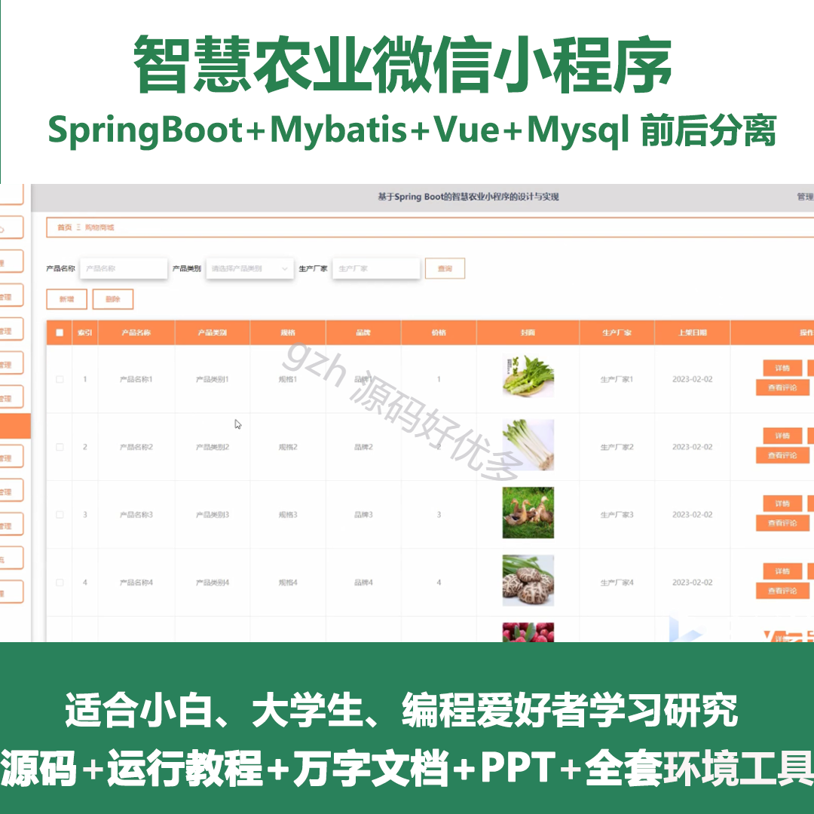
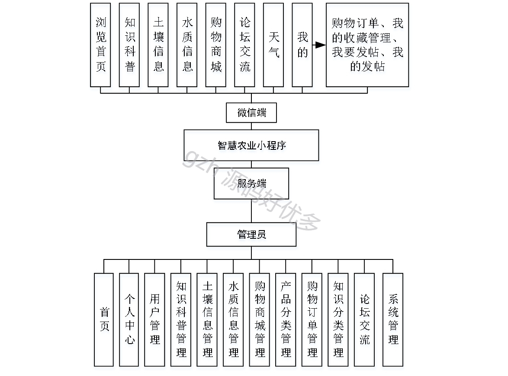
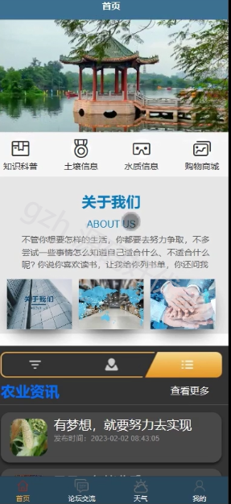
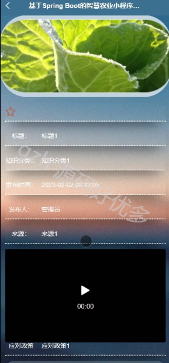
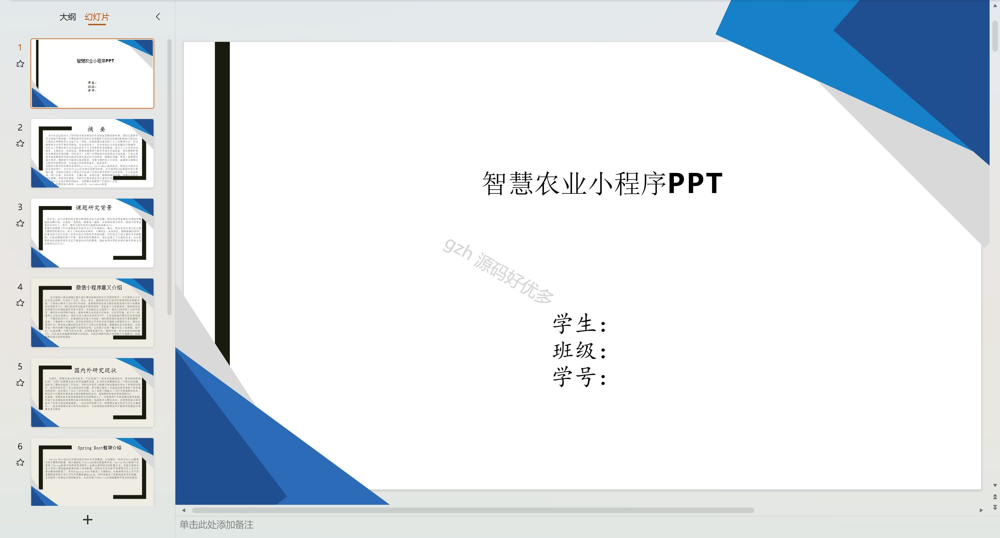
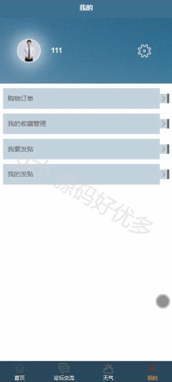
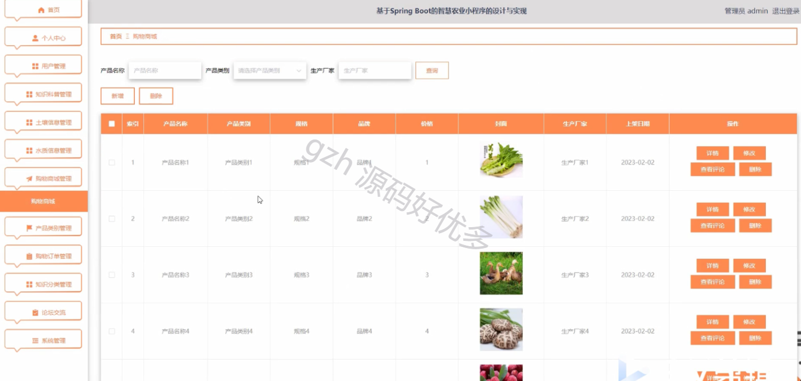
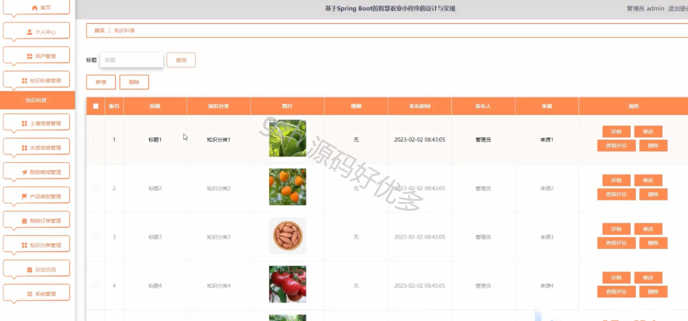
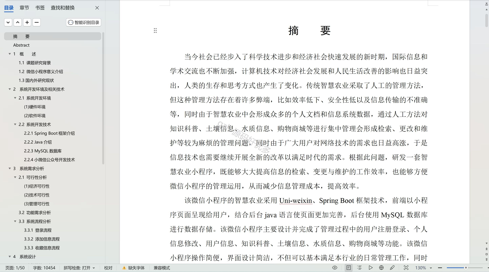

# mpweixinA051
mpweixinA051智慧农业微信小程序LW+PPT
 
## 查看主页获取源码

### 一、作品包含

源码+数据库+设计文档万字+PPT+全套环境和工具资源+部署教程

### 二、项目技术

前端技术：Html、Css、Js、Vue、Element-ui

数据库：MySQL

后端技术：Java、Spring Boot、MyBatis

  

### 三、运行环境

开发工具：IDEA/eclipse + 微信开发者工具

数据库：MySQL5.7

数据库管理工具：Navicat10以上版本

环境配置软件： JDK1.8+Maven3.6.3

前端Nodejs：14

### 四、项目介绍
项目编号：mpweixinA051

智慧农业微信小程序立足于我国现代农业发展的需求，紧跟科技潮流，以科技创新推动农业转型升级，旨在为广大农民、农业企业和农业科技工作者提供一个便捷、高效、智能的服务平台，通过信息化手段助力农业产业升级，促进农业可持续发展，实现乡村振兴。

前台用户功能：浏览首页、知识科普、土壤信息、水质信息、购物商城、论坛交流、天气、我的、购物订单、我的收藏管理、我要发帖、我的发帖。

后台管理员的功能：首页、个人中心、用户管理、知识科普管理、土壤信息管理、水质信息管理、购物商城管理、产品分类管理、购物订单管理、知识分类管理、论坛交流、系统管理。

### 五、运行截图

  
